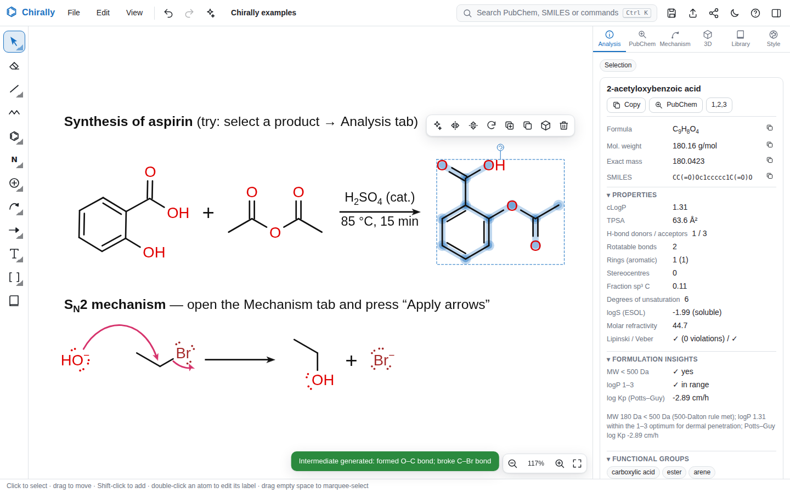
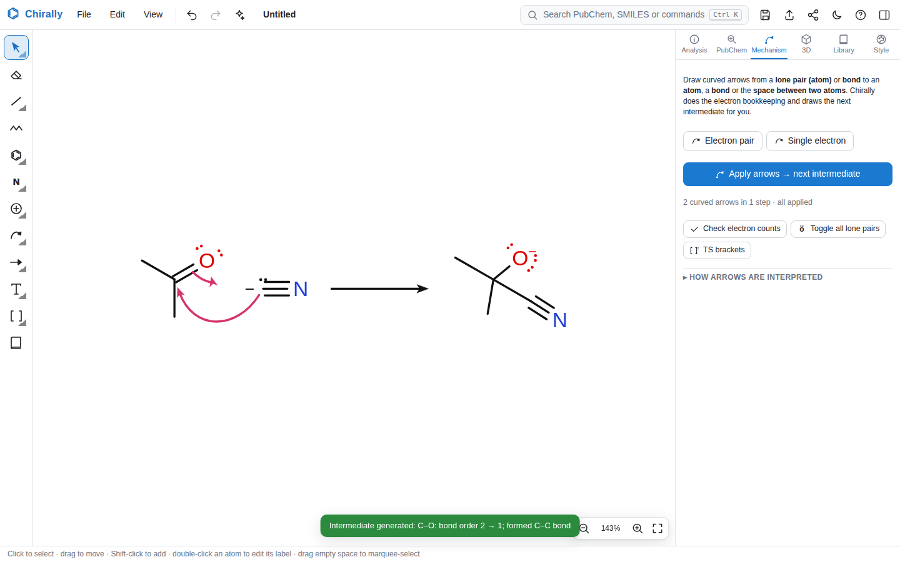

# Chirally

A ChemDraw / ChemSketch-style chemical structure and reaction-mechanism editor that runs entirely in the browser.
It's designed mainly for mouse and keyboard, and also works with touch on tablets and phones.



## Highlights

**Drawing**
- Bonds: single, double, triple, aromatic/delocalised, wedge, hash, hollow wedge, wavy, bold, dashed, dative, hydrogen bond, crossed (unknown E/Z). Clicking a bond with the single-bond tool cycles 1 → 2 → 3, and clicking a wedge again flips it.
- Zig-zag chain tool (shows the bond count while dragging), ring tools (3–8, benzene, cyclopentadiene, cyclohexane chair) with fusing onto bonds, attaching to atoms and spiro rings.
- Atom labels with automatic hydrogens and charges, plus about 100 abbreviations (OMe, CO2H, Boc, TBS, Ts, Fmoc…) that reverse direction automatically (OMe → MeO) and can be expanded to full structures.
- Charges, radicals, lone pairs (computed from the electron count), isotopes.
- Reaction arrows (reaction, equilibrium, unbalanced equilibrium, retrosynthetic, resonance, dashed, no-go), with reagents and conditions above and below; plus signs, text with sub/superscript markup, brackets, transition-state brackets ‡, boxes, ellipses, p and s orbitals.
- **Snapping:** bond angles in 15° steps, fixed bond length, snapping to nearby atoms, joining atoms when you drop one on another, alignment guides while dragging, optional grid. Hold Alt to turn snapping off.
- Selection with rectangle or lasso, move, rotate handle (Shift = 15° steps), flip (keeps the stereochemistry) vs. mirror (gives the enantiomer), scale, duplicate, nudge with the arrow keys.
- Unlimited undo/redo, a floating toolbar for the current selection, and a context menu.

**Chemistry**
- **Geometry optimisation**
  - *Clean Structure* (Ctrl+Shift+K) tidies bond lengths, angles and rings while keeping the drawing's orientation and its stereochemistry.
  - In-browser **3D models**: distance-geometry embedding, then UFF force-field minimisation (L-BFGS), conformer search, an interactive viewer (rotate, zoom, measure distances/angles/dihedrals), and export to XYZ, 3D MOL or PNG.
- **IUPAC names**, generated locally as you draw (IUPAC 2013 rules, PubChem-compatible style where valid):
  - chains, rings, about 80 fused and bridged ring systems with fixed numbering, Hantzsch–Widman heterocycles, von Baeyer and spiro systems;
  - functional-group seniority, esters, amides, salts, hydro prefixes and indicated hydrogen;
  - R/S and E/Z descriptors.

  It matches PubChem's name exactly for 647 of about 700 test compounds; most of the rest differ on purpose to follow current IUPAC rules. If a structure can't be named locally, you can look its name up in PubChem.
- Formula, average and exact mass, m/z, elemental analysis, degrees of unsaturation, canonical SMILES with stereo, live CIP (R/S, E/Z) labels, and valence-error flags.
- Properties: Wildman–Crippen cLogP, TPSA, H-bond donors/acceptors, rotatable bonds, Fsp³, ESOL solubility, molar refractivity, Lipinski and Veber checks, and functional-group detection that highlights the atoms on the canvas. These agree with RDKit to within ±0.002 on 218 of 221 test molecules. The R/S labeller agrees with RDKit's new CIP labeller on 522 test molecules, including pseudoasymmetric r/s centres.
- **Template library** of 171 structures: rings, heterocycles, amino acids, sugars and nucleosides, nucleobases, functional groups, steroids and terpenes, and 61 **cosmetic actives and excipients** (niacinamide, retinoids, AHAs, UV filters, surfactants, emollients…). You can also save your own templates.

**Mechanisms & reactions**



- Electron-pushing arrows: full-headed (electron pair) and fishhook (single electron), anchored to atoms, bonds or the space between two atoms, with draggable curvature.
- **Arrow-pushing simulator**: *Apply arrows → next intermediate* does the electron bookkeeping (lone pairs, bonds, formal charges, radicals). It draws the product with a reaction or resonance arrow and warns about octet violations or arrows that don't make sense.
- Reaction mass balance and atom economy for drawn schemes. Exports reaction SMILES and RXN files.

**PubChem**
- Search by name, CAS number, InChIKey, CID or formula, with autocomplete, and insert the structure (Ctrl+K works from anywhere).
- *Identify* the structure you've drawn, find similar compounds, and look up CAS numbers, synonyms and **GHS hazard pictograms and statements**.

**Files**
- Native `.chirally` (lossless JSON), **ChemDraw CDXML** (import and export), MOL V2000/V3000, SDF, RXN, CML, XYZ and SMILES.
- Export to SVG and PNG (up to 6×, optionally transparent), copy as image, and drag files onto the canvas to open them.
- Autosave, version history, and share links. A share link encodes the drawing into the URL itself; nothing is uploaded.

## Features ChemDraw doesn't have

1. **Arrow-pushing simulator**: draw the curved arrows and Chirally works out the next intermediate, charges included.
2. **Formulation insights** for cosmetic and pharma formulators:
   - skin-penetration checks (500 Da rule, logP 1–3, Potts–Guy log Kp);
   - HLB (Davies and Griffin) for surfactants, with how to use the value;
   - flags for sensitisation alerts and Michael acceptors.
3. **GHS hazards and CAS numbers** pulled from PubChem next to your drawing.
4. **Command palette** (Ctrl+K): type a compound name, a SMILES string or any command.
5. **3D geometry optimisation built in**, with measurement tools; no separate Chem3D needed.
6. **Live CIP labels, IUPAC locant overlay and functional-group highlighting.**
7. **Reaction balance and atom-economy checker.**
8. **Share links, version history, dark mode, and an installable web-app manifest.**
9. **Smart alignment guides** and snapping when you drop an atom onto another.

## Keyboard (ChemDraw/Ketcher style)

| Keys | Action |
| --- | --- |
| Hover an atom + `C N O S P F H I`, `L`=Cl, `B`=Br, `Shift+S`=Si | Change the element |
| Hover an atom + `1` `2` `3` | Sprout a single/double/triple bond |
| Hover an atom + `+` `-` `0`, `.`, `,` | Charge up/down/reset, radical, lone pairs |
| Hover an atom + `M E T A X` | Me, Et, tBu, Ac, Ph labels |
| Hover an atom + `R`, hover a bond + `R`/`5`–`8` | Attach phenyl, or fuse a ring |
| Hover a bond + `1 2 3 4`, `W H Y B D` | Bond order; wedge/hash/wavy/bold/dashed |
| Hover an atom + Enter, or double-click | Type a label (OMe, CO2H, NHBoc…) |
| `V E G R T A Shift+A` | Select, eraser, chain, ring, text, arrow, curved arrow |
| Space + drag, middle drag, two-finger drag | Pan |
| Wheel, pinch, `Ctrl` `+`/`-`, `Ctrl+0` | Zoom, zoom to fit |
| `Ctrl+Z` / `Ctrl+Shift+Z`, `Ctrl+C/X/V/D/A` | Undo/redo, clipboard, duplicate, select all |
| `Ctrl+Shift+K`, `Ctrl+K`, `Ctrl+S`, `Ctrl+O`, `Ctrl+E` | Clean, command palette, save, open, export |
| `?` | All shortcuts |

On touch screens: tap to draw, drag to draw at an angle, pinch to zoom, two fingers to pan, long-press for the context menu.

## Development

```bash
git clone git@github.com:paul-crichton/Chirally.git
cd Chirally
npm install
npm run dev        # http://localhost:5173
npm test           # unit tests (Vitest, 1,134 tests)
npm run e2e        # browser tests (Playwright: desktop and phone layouts)
npm run build      # static production build in dist/
```

There are no runtime dependencies: the chemistry engine, renderer, file formats, force field and 3D viewer are written from scratch in TypeScript. The only network calls go to PubChem's public, CORS-enabled REST API.

### Hosting

`npm run build` produces a static site in `dist/` with no server-side code. Serve it with any static web server (for example nginx or Caddy, perhaps in a Proxmox LXC container, or GitHub Pages), at the site root or under a sub-path. PubChem lookups are made by the visitor's browser, so the server itself needs no internet access.

Some browser features only work over HTTPS (or on `localhost`): offline use, installing it as an app, the Copy/Cut/Paste commands in the Edit menu, right-click menu and selection toolbar, Copy as image, and (in Chrome and Edge) the native Save dialog. Over plain HTTP everything else works: Ctrl+C / Ctrl+X / Ctrl+V still use the system clipboard, the menu and toolbar Copy/Paste only work within the same Chirally tab, and Save downloads the file instead.

### Architecture

```
src/chem/        chemistry engine (pure TS, runs in Node and the browser)
  mol.ts           molecular graph, stereo specs
  smiles.ts        SMILES parser and canonical writer
  rings.ts, aromaticity.ts, valence.ts, canon.ts, stereo2d.ts, cip.ts, formula.ts
  layout2d.ts, clean2d.ts   2D coordinate generation and "Clean Structure"
  3d/              embedding, UFF force field, L-BFGS, conformer search
  iupac/           IUPAC name generation
  properties.ts, props/     cLogP, TPSA, HLB, functional groups…
  formats/         MOL/SDF/RXN/CDXML/CML/XYZ
src/doc/         canvas document model, arrow-pushing engine
src/render/      scene builder (labels, bonds, arrows) → Canvas 2D and SVG
src/editor/      interactive editor: tools, hit testing, snapping, history, keyboard
src/app/         UI shell: toolbar, panels, dialogs, command palette, file I/O
src/viewer3d/    canvas-based 3D viewer
src/services/    PubChem client
```

Coordinates are stored in units of one standard bond length, with y pointing down. The renderer turns the document into simple primitives that are drawn on screen and also written out for SVG/PNG export, so exports look exactly like the canvas.

## Notes

- Hazard data come from PubChem's aggregated GHS notifications. Always check the supplier's SDS.
- Property values (cLogP, TPSA, HLB, log Kp, ESOL) are standard empirical estimates meant for screening.
